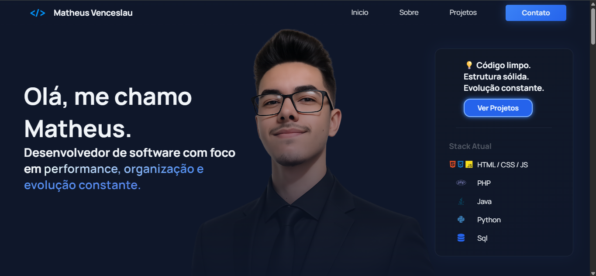

# 💻 Portfólio — Matheus Venceslau

Portfólio pessoal desenvolvido para apresentar minha trajetória como **estudante de Análise e Desenvolvimento de Sistemas**, meus conhecimentos em desenvolvimento web e os projetos que venho desenvolvendo durante minha formação.

O projeto também representa uma aplicação prática dos conhecimentos adquiridos em **HTML5, CSS3 e JavaScript**, buscando criar uma interface própria para apresentar minhas habilidades e experiências.

---

## 📸 Preview



---

## 🚀 Tecnologias utilizadas

* **HTML5** — Estruturação semântica e organização do conteúdo.
* **CSS3** — Estilização, layout, responsividade e efeitos visuais.
* **JavaScript** — Interações e funcionalidades da interface.
* **Git & GitHub** — Versionamento e gerenciamento do projeto.

---

## ✨ Características

* Apresentação pessoal e profissional.
* Seção de habilidades técnicas.
* Apresentação de projetos desenvolvidos.
* Informações sobre formação acadêmica.
* Experiências e conhecimentos.
* Interface responsiva.
* Elementos interativos desenvolvidos com JavaScript.
* Interface inspirada em terminal para complementar a identidade visual.

---

## 📂 Estrutura do projeto

```text
portifolio/
│
├── img/
│   └── Imagens utilizadas no projeto
│
├── index.html
├── style.css
├── terminal.js
└── README.md
```

---

## 🎯 Objetivo

O objetivo deste projeto é funcionar como meu **portfólio profissional**, reunindo projetos, conhecimentos e informações sobre minha formação em um único espaço.

Além de apresentar meu trabalho, o desenvolvimento do portfólio também serve como forma de aplicar e aprimorar conhecimentos em desenvolvimento Front-end.

---

## 📚 Conhecimentos aplicados

Durante o desenvolvimento foram praticados conceitos como:

* Estruturação semântica com HTML5;
* Organização e estilização com CSS3;
* Layouts utilizando Flexbox;
* Responsividade;
* Manipulação do DOM;
* JavaScript;
* Eventos e interações;
* Organização de arquivos;
* Versionamento com Git.

---

## 🔗 Acesse o portfólio

**Portfólio online:**
https://matheusvenceslau.netlify.app/

---

## 👨‍💻 Sobre mim

Sou **Matheus Henrique Luiz Venceslau**, estudante de **Análise e Desenvolvimento de Sistemas** e desenvolvedor Front-end em formação.

Tenho interesse em desenvolvimento web e venho construindo projetos práticos para consolidar meus conhecimentos em **HTML5, CSS3 e JavaScript**.

Atualmente, busco minha **primeira oportunidade profissional na área de tecnologia**, onde possa contribuir com meus conhecimentos, aprender com profissionais experientes e evoluir como desenvolvedor.

---

## 📫 Contato

* **GitHub:** [Matheus-Venceslau](https://github.com/Matheus-Venceslau)
* **LinkedIn:** [Matheus Henrique Luiz Venceslau](https://www.linkedin.com/in/matheusvenceslau/)

---

## 📌 Status

🚧 **Em desenvolvimento**

Este portfólio continuará sendo atualizado conforme novos projetos, conhecimentos e experiências forem adquiridos.
